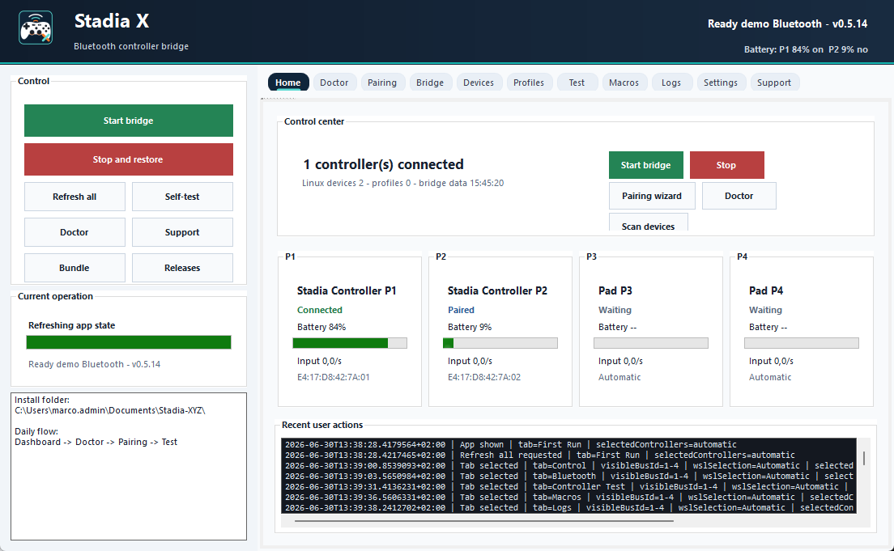
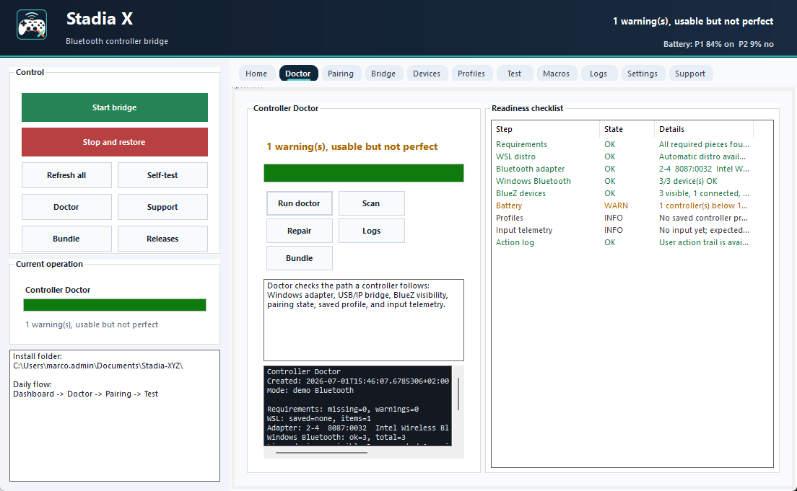
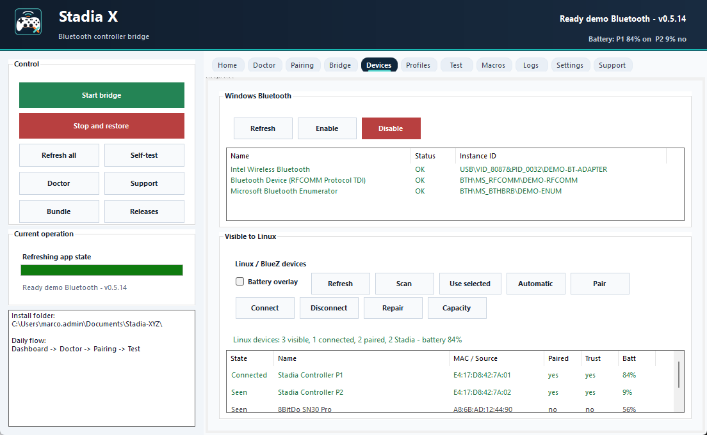

<div align="center">
  
  <h1>Stadia X</h1>
  <p><strong>Use Google Stadia controllers over Bluetooth on Windows as native Xbox 360 gamepads.</strong></p>
  <p>
    <a href="https://github.com/jkid92/Stadia-XYZ/releases/latest"></a>
    
    
  </p>
  <p>
    <a href="https://github.com/jkid92/Stadia-XYZ/releases/latest"><strong>Download latest release</strong></a>
    ·
    <a href="#installation--first-run">Install guide</a>
    ·
    <a href="#troubleshooting">Troubleshooting</a>
  </p>
</div>



Stadia X is a low-latency native bridge for Google Stadia controllers on Windows. It hands your Bluetooth adapter to WSL2, connects controllers through Linux/BlueZ, and exposes them back to Windows as standard Xbox 360 controllers through ViGEmBus.

The app includes a modern control center for setup, bridge start/stop, Bluetooth device discovery, controller profiles, macro editing, battery status, diagnostics, support bundles, and guided troubleshooting.

## Screenshots

| Controller Doctor | Bluetooth Devices |
|---|---|
|  |  |

## Highlights

* **Guided setup and Controller Doctor:** Check WSL, usbipd, Bluetooth, BlueZ, profiles, battery, input telemetry, and logs from one page.
* **Full rumble support:** Force feedback is routed through the virtual Xbox 360 controller.
* **Up to four controllers:** Forward up to four Stadia controllers when your Bluetooth adapter can handle them reliably.
* **Universal game compatibility:** Games see standard Xbox 360 pads through ViGEmBus.
* **Bluetooth device visibility:** Compare what Windows sees with what Linux/BlueZ sees after adapter handoff.
* **Battery overlay:** Tiny top-right overlay with white text, red warning below 10%, and compact P1/P2/P3/P4 labels.
* **36-key macro system:** Assistant and Capture act as modifier keys for media controls, keyboard shortcuts, and custom actions.
* **Support bundle:** Export logs, diagnostics, selected profiles, controller telemetry, and session reports for troubleshooting.
* **Auto-restore:** Return the Bluetooth adapter to Windows when you stop the bridge or close the app.

---

## 🛠️ Requirements
1. **Windows 10 or Windows 11**
2. **Hardware Virtualization Enabled:** Ensure VT-x (Intel) or SVM (AMD) is enabled in your motherboard's BIOS (required for WSL2).
3. **Bluetooth Adapter:** Either a built-in motherboard Wi-Fi/BT card or a USB Bluetooth dongle.
4. **ViGEmBus Driver:** Required for Xbox 360 controller emulation on Windows.

---

## 🚀 Installation & First Run

1. Download the latest `Stadia-X-<version>-Setup.exe` from GitHub Releases and run it. The installer copies Stadia X to your user profile and creates shortcuts that launch `StadiaX.exe`.
2. If you prefer portable mode, download the release ZIP, extract it, then run `StadiaX.exe` directly or use `Install-StadiaX.bat` to create shortcuts. **Do not run Stadia X from inside the ZIP file.**
3. In the GUI, open `Doctor` and run the readiness checklist from top to bottom.
4. **The Setup Phase:**
   * The script will automatically install `usbipd`.
   * If you already have a usable WSL2 distro, Stadia X can use it automatically. It prefers Ubuntu/WSL2 when present, then falls back to any WSL2 distro. If no usable distro exists, it installs `Ubuntu`.
   * **Note:** You will likely be prompted to **Restart your PC** during the first run. Please restart, reopen `StadiaX.exe`, and press `Start` again.
5. **First Pairing:**
   * Once the script boots Linux, it will look for your controller.
   * Turn on up to four Stadia Controllers, then hold **Stadia + Y** until the light flashes orange to enter pairing mode.
   * They will connect automatically. Next time you play, you just need to turn the controller on!
6. **Game On!** Leave `StadiaX.exe` open while you play. When you are done, press `Stop` or use the tray menu to restore your Bluetooth adapter to Windows.

---

## 🖥️ Graphical Control Panel

Run `StadiaX.exe` to open the Stadia X Control Center. `Start-GUI.bat` remains available only as a compatibility launcher: it opens `StadiaX.exe` when present.

The native launcher is a C# WinForms executable. It is the main interface for setup, Bluetooth selection, Linux/BlueZ devices, controller profiles, macros, controller testing, battery warnings, support bundles, update checks, Start/Stop orchestration, self-test output, and live log viewing. The legacy batch and PowerShell scripts remain in the package only as compatibility/debug tools.

The GUI lets you:
* Follow a first-run checklist that walks through release files, ViGEmBus, usbipd, WSL, Bluetooth selection, startup, and controller testing.
* Check the installed version against the latest GitHub Release and open the download page.
* Check required tools and runtime files before starting.
* Run a pre-start setup audit and a post-start health audit.
* Let Stadia X auto-select the best WSL distro, or manually pin the distro used for Bluetooth handoff and Linux commands.
* Inspect all USB/IP devices with BUSID, VID:PID, name, state, and Bluetooth detection hint.
* Manually choose or type the exact Bluetooth USB/IP BUSID that should be handed fully to Linux.
* Inspect Windows Bluetooth status, adapters, service state, known devices, and active/OK devices.
* Inspect Bluetooth devices visible from Linux/BlueZ after the adapter is handed to WSL.
* Select up to four Stadia controller MAC addresses manually, or clear the selection to return to automatic controller detection.
* Estimate whether the detected Bluetooth adapter is likely to handle 1, 2, 3, or 4 Stadia controllers.
* Run a Capacity Wizard that scans Linux/BlueZ, compares visible controllers, active profiles, telemetry, and adapter guidance, then writes `logs/capacity-wizard.txt`.
* Enable Party Mode for up to four controllers. It saves visible Stadia MACs when Linux can see them, uses auto-connect profiles when available, and otherwise leaves startup in automatic mode.
* Run a Repair flow that refreshes the Linux Bluetooth stack and reconnects selected Stadia MACs without wiping the user's profiles.
* Run a full self-test from the Support tab or `Test-StadiaX.ps1`, producing `logs/self-test.txt`.
* Create a human-readable session report with Bluetooth, controller, battery, WSL, runtime, and recent Linux status details.
* Pair, trust, and connect selected Linux/BlueZ devices from the GUI while keeping automatic detection available.
* Save controller profiles with name, MAC address, preferred pad slot, and startup auto-connect preference.
* Enable or disable the selected Bluetooth adapter from the GUI when troubleshooting.
* Start the bridge with Administrator elevation when needed.
* Minimize the GUI to the system tray and control Start/Stop from the tray menu.
* Watch live Windows/Linux status events while the bridge starts, including a human-readable timeline of what is happening.
* See whether Linux is scanning, has found the controller, is connecting, or is waiting for an input device.
* Let Linux auto-recovery try to reconnect selected/known controllers if Bluetooth drops during play.
* Stop Stadia X and restore the Bluetooth adapter.
* Read controller battery levels on the Home screen and get a tiny top-right overlay warning when a connected controller is at 30% or lower. Battery refresh runs every 5 minutes while the GUI is open.
* Test controller buttons, triggers, sticks, packet rate, deadzone, health summary, and rumble routing for up to four controllers.
* Edit macros visually by chord or directly in `stadia_buttons.ini`, with automatic timestamped backups.
* Create a support ZIP with logs, Bluetooth diagnostics, controller telemetry, selected profiles, and environment snapshots.

> Developer note: the Windows receiver now runs inside `StadiaX.exe`. A runnable package still needs `ViGEmClient.dll` beside the app and `stadia_bridge` for the Linux side. The GUI reports missing runtime files clearly before startup continues.

Release packages are built automatically by GitHub Actions. The preferred download is the installer EXE, while the ZIP remains available for portable use and troubleshooting. Both include:
* `Install-StadiaX.bat` and `Install-StadiaX.ps1`
* `StadiaX.exe`
* `Resolve-WslDistro.ps1`
* `Test-StadiaX.ps1`
* `ViGEmClient.dll`
* `stadia_bridge`

For local builds or release maintenance, see `BUILD.md`.

Runtime logs are written under `logs/`:
* `status.log` records Windows startup and teardown events.
* `linux-status.log` records structured Linux bridge states such as scanning, connecting, and input-device detection.
* `linux.log` keeps the raw Linux core output.
* `bluetooth-diagnostics.txt` captures Linux/BlueZ adapter, controller, module, and kernel hints after the Linux core starts.
* `controller-state.json` is written by the integrated Windows receiver inside `StadiaX.exe` and powers the Test screen. It contains a `controllers` array for up to four pads, plus packet counters and per-pad activity.
* `self-test.txt` is written by the native GUI self-test or `Test-StadiaX.ps1` and summarizes missing files, runtime binaries, WSL, usbipd, ViGEmBus, and macro config state.
* `receiver.log` keeps integrated Windows receiver output when the bridge is started from `StadiaX.exe`.

If more than one Bluetooth-looking adapter appears, open the `Settings` tab, select the row that matches your real Bluetooth controller or dongle, and confirm that the same BUSID appears before pressing Start. `StadiaX.exe` verifies that the chosen BUSID still appears in `usbipd list` and logs whether usbipd reports it as attached after handoff.

The `Settings` tab also shows the WSL distro Stadia X will use. Leave it on `Automatic` for the recommended path, or select a specific distro if you keep multiple WSL installs. Startup stores manual selection in `selected_wsl_distro.txt` and passes every Linux command through that distro instead of relying on Windows' default WSL setting.

The `Devices` tab shows both sides of the handoff. The Windows panels show whether Windows sees a Bluetooth adapter, whether the Bluetooth service is running, how many non-adapter Bluetooth devices Windows currently reports as active/OK, and all known Bluetooth PnP devices. It also estimates Stadia controller capacity from adapter/driver/chipset hints, with 4 controller support as the software target and the adapter as the real-world limiter. Adapter guidance flags common limits such as older/generic dongles or Bluetooth audio devices sharing the same radio. The `Linux / BlueZ devices` panel queries `bluetoothctl` inside WSL, can run a short scan, and can save up to four Stadia controller MAC addresses for manual startup selection. If no manual MAC is saved, startup keeps using automatic Stadia detection.

Windows does not reliably expose the Bluetooth radio specification version or a maximum device count through standard local APIs, so the GUI reports driver information and explains that the practical connection limit depends on adapter, driver, and profile mix.

For the best chance of running four Stadia controllers at once, use a modern Bluetooth 5.x adapter or integrated Wi-Fi/Bluetooth chipset, keep Bluetooth headphones/speakers off the same radio while playing, and prefer manual controller profiles so startup connects the intended pads in a stable order. Generic or older Bluetooth 4.x dongles may still work well for one or two controllers but can be less reliable at four.

The `Profiles` tab stores friendly controller profiles in `controller_profiles.json`. Applying profiles writes the selected MAC addresses to `selected_controller_macs.txt`; pressing `Automatic` in the Devices tab clears that file and restores fully automatic startup detection.

The `Macros` tab has both a visual chord editor and the raw `stadia_buttons.ini` editor. Use the visual editor to choose a chord, type a shortcut, apply it to the editor, then press `Save`.

The `Support` tab can create a support bundle under `support-bundles/`. That ZIP is meant for troubleshooting and includes current logs, selected controller files, macro config, version info, a session report, and command snapshots such as `usbipd list` and WSL Bluetooth output. The same tab can also run the self-test and export a standalone session report without creating a ZIP.

---

## ⌨️ The Macro Shortcut System

Stadia X unlocks the two middle buttons (**Assistant** and **Capture**) to act like "Shift" keys for your controller, giving you **36 bindable shortcuts** in total (17 Assistant chords + 17 Capture chords + 2 solo presses).

Open `stadia_buttons.ini` in Notepad to configure your shortcuts. By holding Assistant or Capture, you can press any other button on the controller to trigger Windows keyboard shortcuts, media controls, or volume!

**Examples included by default:**
* `Capture + D-Pad Up/Down` = Volume Up/Volume Down
* `Capture + D-Pad Left/Right` = Next/Previous Track
* `Assistant + L3` = Ctrl+Alt+Delete

### 🗂️ Alternate Layouts

Don't want to build your own config from scratch? The `Alternate_Layouts` folder includes three ready-made profiles:

| File | Best for |
|---|---|
| `stadia_buttons PC.ini` | Windows productivity — Copilot, Snipping Tool, window snapping, clipboard |
| `stadia_buttons GAMING.ini` | RPGs & survival games — Inventory, Map, Quick Save, Hotbars, Push-to-Talk |
| `stadia_buttons UTILS.ini` | Capture & streaming — NVIDIA Overlay, Game Bar, screenshots, FPS counter |

To use one, copy it from `Alternate_Layouts` into the main folder and rename it to `stadia_buttons.ini`.

---

## ⚠️ Troubleshooting

**1. Windows Defender / SmartScreen blocks the app**
Because Stadia X controls virtual gamepads and can inject configured keyboard shortcuts, some antivirus software may flag the unsigned app as suspicious. This is a false positive. Click "More Info" -> "Run Anyway", or for a permanent fix, add the Stadia X folder to your antivirus exclusions.

**2. Script crashes with "Virtual Machine Platform is not enabled"**
You need to enable hardware virtualization in your BIOS. Look for `VT-x` (Intel) or `SVM / AMD-V` (AMD) and set it to Enabled.

**3. Script asks for my Bluetooth BUSID manually**
Sometimes Windows names your Bluetooth adapter strangely. If it asks for your BUSID, look at the list printed on the screen, find the item that looks like your Bluetooth adapter (e.g., "Intel Wireless Bluetooth"), and type the number next to it (e.g., `1-14`).

**4. `bluetoothctl: command not found`**
This happens on a clean Ubuntu WSL install where the `bluez` package is missing. The script now installs it automatically, but if you hit this on an older version, open a WSL terminal and run:
```
sudo apt-get update && sudo apt-get install -y bluez
```

---

## 🏆 Credits & Acknowledgements
* **[jocxfin]**: Original author of the `stadia-w-rumble-windows` proof-of-concept, which provided the foundational C++ UDP bridge and ViGEm implementation this project was built upon.
* **[Nefarius]**: Creator of the ViGEmBus driver, making Xbox 360 controller emulation possible on Windows.
