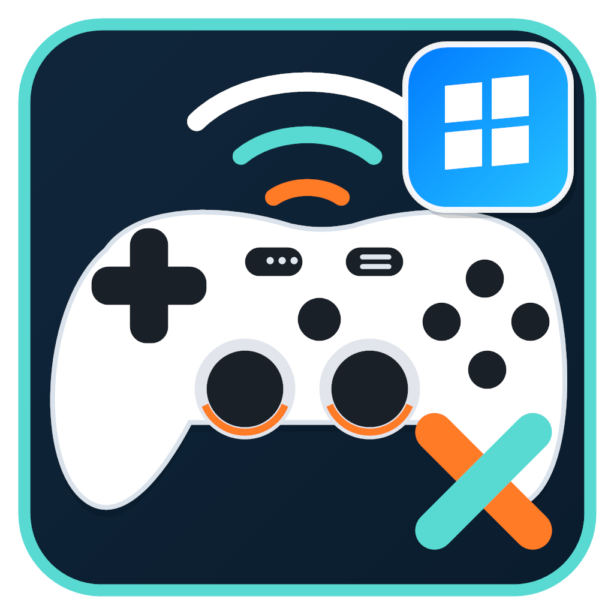
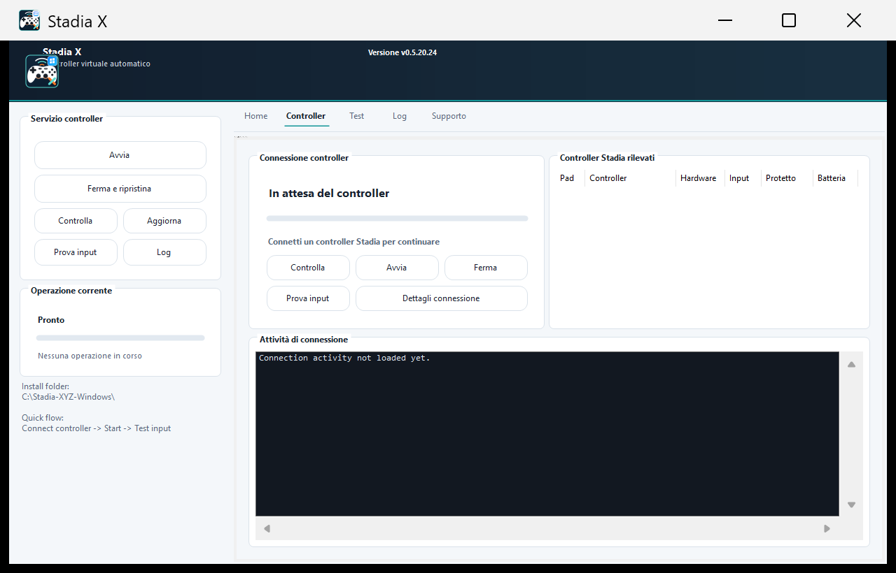
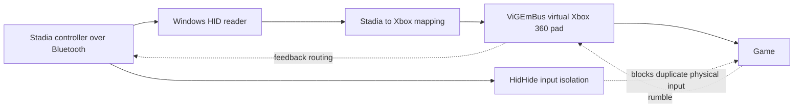

# Stadia X Windows Native

<p align="center">
  
</p>

<p align="center"><strong>Use Bluetooth Stadia controllers as Xbox 360 gamepads on Windows, without WSL or manual configuration.</strong></p>

> [!IMPORTANT]
> This is the experimental Windows Native branch. The stable Linux/WSL edition remains available on [`main`](https://github.com/jkid92/Stadia-XYZ/tree/main).


Stadia X Windows Native reads the physical Stadia controller directly, maps its input, and creates a standard virtual Xbox 360 controller through ViGEmBus. HidHide isolates the original device so games receive one input stream instead of duplicated button presses.

## What It Does

- Starts the complete controller route with one **Start** button.
- Includes pinned HidHide and ViGEmBus installers, verifies their SHA-256 hashes and Nefarius signatures, and installs them automatically when needed.
- Hides physical Stadia input from games while the virtual controller is active.
- Restores physical input when **Stop and restore** is pressed or startup fails.
- Supports up to four controllers with separate P1-P4 virtual slots.
- Shows live connection phases, progress, detected devices, input rate, logs, and user actions.
- Reads the controller battery level from Windows when the Bluetooth driver exposes it, including P1-P4 dashboard and compact overlay warnings.
- Includes a visual controller test, button highlights, stick and trigger telemetry, and rumble tests.
- Offers Italian and English UI, verified layouts from 100% through 200% DPI, and multi-monitor window recovery.
- Downloads verified updates in-app and keeps a rollback copy in case the new version does not remain healthy.
- Keeps technical configuration out of the normal user flow.

| Dashboard | Controller connection |
|---|---|
|  |  |

## Install

1. Open the [latest releases](https://github.com/jkid92/Stadia-XYZ/releases).
2. Download `Stadia-X-Windows-Native-<version>-Setup.exe` from a release tagged `windows-native-v...`.
3. Run the setup and launch **Stadia X Windows Native**.
4. Pair the Stadia controller in Windows Bluetooth settings if it is not paired yet.
5. Press **Start**. Stadia X checks drivers, protects physical input, creates the virtual Xbox 360 pad, and starts forwarding input.

Windows may request administrator permission while a driver is installed or while input isolation is configured. No separate configuration tool is required.

## Daily Use

1. Turn on the paired Stadia controller.
2. Open Stadia X Windows Native.
3. Press **Start**.
4. Open **Test input** to confirm buttons and sticks.
5. Press **Stop and restore** before troubleshooting the physical device or uninstalling drivers.

## How It Works



The physical device remains visible to Stadia X but is hidden from games. The virtual Xbox 360 pad is the only gameplay input device, preventing duplicated presses.

## Requirements

- Windows 10 or Windows 11, 64-bit.
- A Bluetooth adapter supported by Windows.
- A Stadia controller already switched to Bluetooth mode.
- Administrator permission when Windows needs to install or configure drivers.

The application package includes its .NET runtime, native client libraries, and the official HidHide and ViGEmBus installers. Their pinned hashes and Authenticode publisher are checked before automatic installation. `winget` is only a development fallback and is not required by the end user.

## Recovery And Logs

- **Check** refreshes the physical controller inventory without starting the virtual route.
- **Stop and restore** stops the receiver and disables the HidHide cloak, even after a partial startup.
- **Connection details** opens the latest controller probe report.
- **Logs** shows the native timeline, user actions, and application diagnostics.
- **Support** creates a bundle with logs and environment details for issue reports.

If Start cannot find a controller, Stadia X opens Windows Bluetooth settings. Pair or reconnect the controller, return to the app, and press **Check** or **Start** again.

## Build From Source

```powershell
dotnet build src\StadiaX.ControlCenter\StadiaX.ControlCenter.csproj -c Release
./build/Package-WindowsNative.ps1 -Version local
./build/Build-WindowsNativeInstaller.ps1 -Version local
```

The release workflow builds the self-contained package, installer, and SHA-256 files for tags matching `windows-native-v*`.

## Credits

- [ViGEmBus](https://github.com/nefarius/ViGEmBus) for virtual Xbox controller support.
- [HidHide](https://github.com/nefarius/HidHide) for physical input isolation.
- [HidSharp](https://github.com/IntergatedCircuits/HidSharp) for native HID access.

Stadia X is an independent community project and is not affiliated with Google, Microsoft, or Nefarius Software Solutions.
