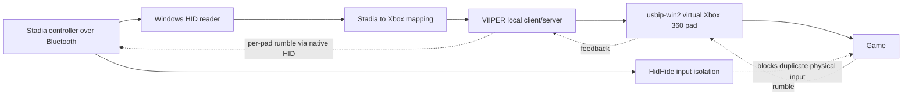

# Stadia X Windows

<p align="center">
  
</p>

<p align="center"><strong>Use Bluetooth Stadia controllers as Xbox 360 gamepads on Windows, without WSL or manual configuration.</strong></p>

> [!IMPORTANT]
> This is the only active Stadia X development line. Linux/WSL and the previous Windows generation are frozen as historical releases; HID experiments now ship inside this same Windows application.


Stadia X Windows Native reads the physical Stadia controller directly, maps its input, and creates a standard virtual Xbox 360 controller through VIIPER and usbip-win2. HidHide isolates the original device so games receive one input stream instead of duplicated button presses.

The current development line continues the consolidated native backend. Windows HID discovery, automatic Stadia Bluetooth pairing, controller state, mapping, physical-device isolation, per-pad vibration, macros, and virtual-controller output have separate ownership boundaries. The virtual output backend now uses VIIPER 0.7.0 with usbip-win2 0.9.7.8.

## What It Does

- Starts the complete controller route with one **Start** button.
- Includes pinned HidHide, VIIPER and usbip-win2 components, verifies their SHA-256 hashes and expected signatures, and installs them automatically when needed.
- Hides physical Stadia input from games while the virtual controller is active.
- Restores physical input when **Stop and restore** is pressed or startup fails.
- Supports up to four controllers with separate P1-P4 virtual slots.
- Shows live connection phases, progress, detected devices, input rate, logs, and user actions.
- Reads the controller battery level from Windows when the Bluetooth driver exposes it, including the P1-P4 dashboard and the same compact pill overlay used by the Linux edition: white text normally and red below 10%.
- Includes a visual controller test, button highlights, stick and trigger telemetry, and native low-latency rumble tests.
- Lets hardware testers switch the live rumble transport from the Home page between Auto, the original HID stream, dedicated Win32 `WriteFile`, `HidD_SetOutputReport`, and experimental `HidD_SetFeature`; logs record the requested and effective route.
- Keeps all HID output experiments inside the unified Windows installation, with one identity, one update channel, and one set of settings and logs.
- Provides an Xbox-first visual mapping editor: click a target on the controller image and press the physical button to associate it. Manual recording, guided **Map all**, named profiles, conflict prevention, and live runtime reload remain available.
- Supports preferred physical-controller profiles based on the Bluetooth address, keeping P1-P4 ordering predictable across reconnects.
- Runs 36 configurable Assistant/Capture shortcuts directly in the Windows receiver, with live configuration reload and game-input suppression while a macro chord is held.
- Uses modern Windows Bluetooth LE discovery and pairing first, with the compatible Win32 route retained as an automatic fallback.
- Reads battery from Windows device properties and falls back to the Stadia BLE Battery Service (`0x180F` / `0x2A19`) when available.
- Includes a Windows Native Controller Doctor, one-click repair, capacity report, richer support bundle, and automatic virtual-slot expansion when another Stadia controller appears.
- Offers Italian and English UI, a focused 1280x820 at 100% DPI layout check, and multi-monitor window recovery.
- Downloads verified updates in-app and keeps a rollback copy in case the new version does not remain healthy.
- Keeps technical configuration out of the normal user flow.

| Dashboard | Controller connection |
|---|---|
|  |  |

### Visual Mapping


## Install

1. Open the [latest releases](https://github.com/jkid92/Stadia-XYZ/releases).
2. Download `Stadia-X-Windows-Native-<version>-Setup.exe` from the latest release tagged `windows-native-v...`.
3. Run the setup and launch **Stadia X Windows Native**.
4. Put an unpaired Stadia controller in Bluetooth pairing mode.
5. Press **Start**. Stadia X searches, pairs, checks drivers, protects physical input, creates the virtual Xbox 360 pad, and starts forwarding input automatically.

Setup requests administrator permission once and installs the required HidHide and usbip-win2 drivers silently when missing. The first usbip-win2 installation can require one Windows restart; subsequent starts are automatic. The .NET 10 runtime and VIIPER executable are bundled, so no separate runtime or configuration tool is required.

## Daily Use

1. Turn on the paired Stadia controller.
2. Open Stadia X Windows Native.
3. Press **Start**.
4. Open **Mapping + Test** to confirm buttons and sticks or customize the mapping.
5. Additional paired controllers are detected and added to the running receiver automatically.
6. Press **Stop and restore** before troubleshooting the physical device or uninstalling drivers.

## How It Works


```mermaid
flowchart LR
    A["Stadia controller over Bluetooth"] --> B["Windows HID reader"]
    B --> C["Stadia to Xbox mapping"]
    C --> D["VIIPER local client/server"]
    D --> E["usbip-win2 virtual Xbox 360 pad"]
    E --> G["Game"]
    F["HidHide input isolation"] -. blocks duplicate physical input .-> G
    A --> F
    G -. rumble .-> E
    E -. feedback .-> D
    D -. per-pad rumble via native HID .-> A
```

The physical device remains visible to Stadia X but is hidden from games. The virtual Xbox 360 pad is the only gameplay input device, preventing duplicated presses.

Internally, the receiver targets a virtual-gamepad interface and sends bounded latest-state reports to the private VIIPER process over localhost. VIIPER presents each slot through usbip-win2 as an Xbox 360 controller and returns per-pad rumble feedback. HID parsing, mapping profiles, reconnection, telemetry, and the UI remain independent from the virtual bus. Legacy WSL bridge commands are rejected by the Windows Native executable.

## Requirements

- Windows 10 or Windows 11, 64-bit.
- A Bluetooth adapter supported by Windows.
- A Stadia controller already switched to Bluetooth mode.
- Administrator permission when Windows needs to install or configure drivers.

The application package includes its .NET 10 runtime, the official VIIPER standalone server, and the HidHide and usbip-win2 installers. Their pinned hashes and Authenticode publishers are checked before automatic installation. `winget` is not required by the end user.

## Recovery And Logs

- **Check** refreshes the physical controller inventory without starting the virtual route.
- **Stop and restore** stops the receiver and disables the HidHide cloak, even after a partial startup.
- **Connection details** opens the latest controller probe report.
- **Logs** shows the native timeline, user actions, and application diagnostics.
- **Support** creates a bundle with logs and environment details for issue reports.

If Start cannot find a controller, put it in Bluetooth pairing mode and press **Start** again. **Repair** restores input isolation, restarts known Stadia devices, rescans Windows hardware, and relaunches the receiver as one operation.

## Build From Source

```powershell
dotnet build src\StadiaX.ControlCenter\StadiaX.ControlCenter.csproj -c Release
./build/Package-WindowsNative.ps1 -Version local
./build/Build-WindowsNativeInstaller.ps1 -Version local
```

The release workflow builds one self-contained package, installer, and SHA-256 set for tags matching `windows-native-v*`.

## Release Policy

- **Active**: the latest unified experimental Windows release.
- **Historical Linux/WSL**: `v0.5.41`.
- **Last ViGEm-based Windows release**: `windows-native-v0.9.2`.

Intermediate editions and separate HID Lab packages are retired. Their functionality continues in the unified Windows line.

## Credits

- [VIIPER](https://github.com/Alia5/VIIPER) for local virtual USB device emulation and its C# client.
- [usbip-win2](https://github.com/vadimgrn/usbip-win2) for the signed Windows USB/IP driver and client.
- [HidHide](https://github.com/nefarius/HidHide) for physical input isolation.
- [HidSharp](https://github.com/IntergatedCircuits/HidSharp) for native HID access.
- [Scalee/stadia-dongle](https://github.com/Scalee/stadia-dongle) and [danzig666/stadia-dongle-esp](https://github.com/danzig666/stadia-dongle-esp) as independent protocol and reconnect references. Their GPL source is not incorporated into Stadia X.

Stadia X is an independent community project and is not affiliated with Google, Microsoft, or Nefarius Software Solutions.
